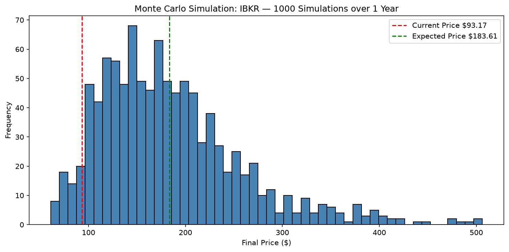

# S&P 500 Risk Analyzer

A Python tool that scans all S&P 500 stocks under $100 and ranks them 
by risk-adjusted return to help students find the best investment opportunities.

## What it does
- Fetches real-time price data for all S&P 500 stocks using Yahoo Finance
- Filters for stocks under $100 (accessible for student investors)
- Ranks stocks by Sharpe Ratio — return per unit of risk
- Flags entry signals using 50-day moving average crossover
- Runs 1000 Monte Carlo simulations on the top pick to project future prices

## Concepts Used
- Sharpe Ratio: measures return relative to risk
- Annualized volatility: standard deviation of daily returns scaled to 1 year
- Value at Risk (VaR): worst case daily loss at 95% confidence
- Monte Carlo simulation: 1000 randomized price path projections

## Output

## Libraries
- yfinance — real market data
- pandas — data manipulation
- numpy — mathematical calculations
- matplotlib — visualization

## How to Run
pip install yfinance pandas numpy matplotlib
python script.py
